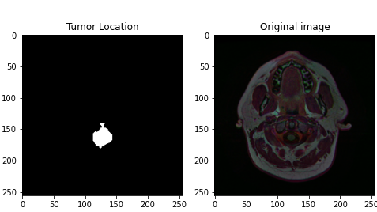
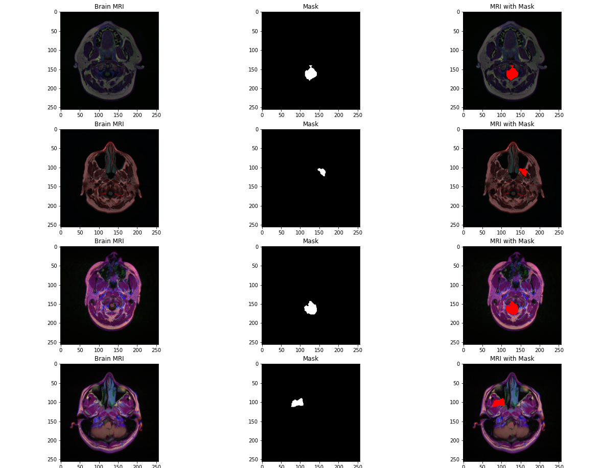
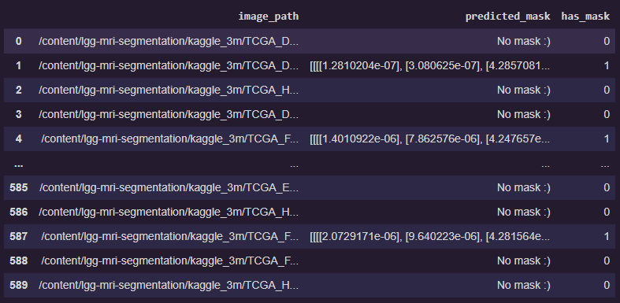
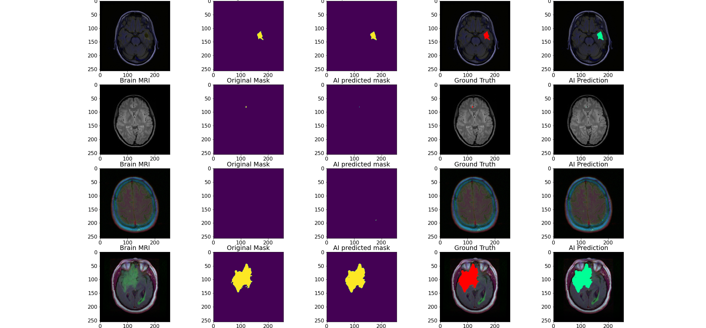

<h1 align="center">Brain Tumor Segmentation And Classification using ML</h1>

A project to classify and perform segmentation for Brain tumors in Brain MRI images.
It is successfully able to classify if a person has tumor, or not, and locates the tumor
if present.

## Installation and Usage

This project uses `pipenv` for dependency management. You need to ensure that you have pipenv installed.

Here are the commands to facilitate using this project.

#### Clone the repo

```sh
git clone https://github.com/Rohith04MVK/Brain-Tumor-Segmentation-And-Classification
```

#### Install dependencies and Open the shell

```sh
# Install dependencies
pipenv sync -d

# Open the venv shell
pipenv shell
```

#### Download data

```sh
# Download segmentation data
cd data/segmentation
python download_segmentation_data.py

# Download classification data
cd data/classification
python download_classification_data.py
```

#### Run the scripts present

```sh
# Run the segmentation script
python src/train_seg.py

# Run the classification script
python src/train_clf.py
```

#### Run the main script

```sh
python example.py
```

**Note: You can get the pretrained models [here](https://drive.google.com/drive/folders/17c9VjWuyVrShYdFt4E5lC0bUZWFTBgzi?usp=sharing).**

## Project structure

This project has 3 main sections.

- `data` contains the scripts to download data.
- `notebooks` contains the well-documented jupyter notebooks.
- `src` contains the scripts for training and interacting with models.

## Data

The dataset being used here is [lgg-mri-dataset](https://www.kaggle.com/mateuszbuda/lgg-mri-segmentation).
This has the brain MRI images, and it's respective masks too (as `.tif` files).

When using, this dataset is split into,
- 3006 Train images
- 590 Testing images
- 333 Validation images

Here is an image of the Mask and the MRI image


This is the mask applied on the MIR


## Predictions

The model returns a pandas dataframe as its output


These are the model predictions for the images,

